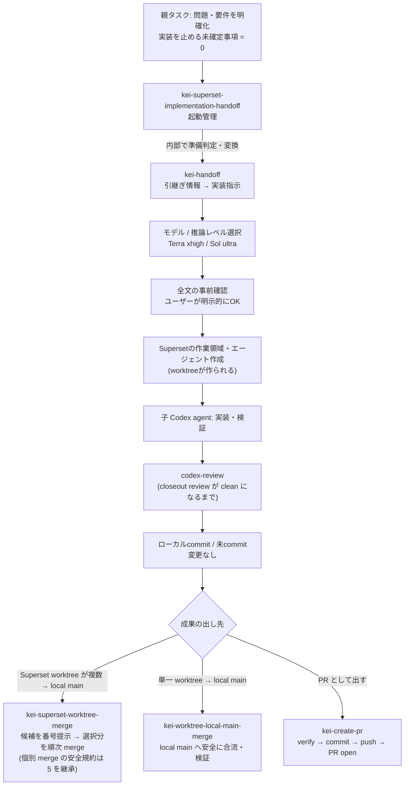

# Superset Handoff Flow

Codexの親タスクで問題・期待結果・制約を明確にし、自己完結した実装指示、モデル、推論レベルを確認してから、[Superset](https://superset.sh)経由で子のCodexエージェントにリポジトリ単位の調査・実装を委譲し、レビュー・統合まで安全に回すためのskillセットです。

親で固定するのは、ユーザー判断が必要な問題・成功条件・制約です。root cause、実装方式、対象ファイル、検証 command は子 agent が repo を調査して決めます。

## Flow



通常ユーザーが呼ぶのは`$kei-superset-implementation-handoff`だけです。問題・期待結果・成功条件・制約が会話で明確になり、実装を止める未確定事項が0件なら、内部で`$kei-handoff`が実装指示を作ります。その全文、モデル、推論レベル、起動方式を事前提示し、ユーザーが明示的にOKした後だけSupersetの作業領域などを作成します。不足があれば起動せず、必要な確認を1つ返します。

モデルの既定は、通常実装が`gpt-5.6-terra` / `xhigh`、高難易度実装が`gpt-5.6-sol` / `ultra`です。実際に起動するCodex CLIの`codex debug models`で利用可能性を確認し、利用できない組へ黙って変更しません。

## Skills

| # | skill | 役割 |
|---:|---|---|
| 1 | `kei-handoff` | 引継ぎ情報を検証し、判断内容を変えず自己完結した日本語の実装指示へ変換する |
| 2 | `kei-superset-implementation-handoff` | 1を内部利用し、実装指示全文・モデル・推論レベルの承認後にだけSupersetを起動して、Codexの実行開始を証拠で確認する |
| 3 | `codex-review` | 子 agent の closeout review。accepted finding がゼロになるまで回す（helper script 同梱） |
| 4 | `kei-superset-worktree-merge` | Superset が作った worktree 群を番号付きで提示し、選択分を順番に merge（安全確認は 5 の規約を継承） |
| 5 | `kei-worktree-local-main-merge` | 単一 worktree の完了 commit を親 repo の local `main` に安全に合流する本体手順 |
| 6 | `kei-create-pr` | PR として出す場合の workflow。verify → commit → push → PR open まで |

## Setup

前提: [Codex CLI](https://github.com/openai/codex) と [Superset CLI](https://superset.sh) 。未導入の場合は各公式手順でインストール・認証してください（[SETUP.md](SETUP.md) 参照）。

```bash
git clone https://github.com/kei-prog/superset-handoff-flow.git
cd superset-handoff-flow
./install.sh
```

`install.sh` は冪等で、前提 command の確認 → `~/.codex/skills/` への個別 symlink → 導入検証まで行います。既存 skill は上書きしません。

導入確認は Codex セッションで `$kei-superset-implementation-handoff` を呼び出せることです。内部依存として `$kei-handoff` も配置されます。Codex では skill が `$skill名` の形で候補表示・発動されることがあります。

### Codex にセットアップさせる

Codex セッションに次をそのまま貼れば、Superset の導入から skill の global 配置・検証まで自動で完了します。

```text
https://github.com/kei-prog/superset-handoff-flow をセットアップしてください。

1. この repo を local に clone する（既に clone 済みならそれを使い、git pull で最新化する）。
2. repo 内の SETUP.md を読み、その手順に従う。要点:
   - ./install.sh を実行し、skills/* を ~/.codex/skills/ に symlink として global 配置する。
   - ./install.sh は superset CLI を自動インストールしない。MISSING の検出と skill 配置・検証だけを行う。
   - install.sh が superset を MISSING と報告したら、公式 https://superset.sh の手順でインストール・認証し、superset status が通ることを確認してから install.sh を再実行する。
   - Superset は Experience v2 mode を有効にしておく。この設定が確認できない場合は、ユーザーに Superset app で Experience v2 mode を有効化してもらい、完了後に再確認する。
   - 既存の同名 skill（実体ディレクトリ）があった場合は上書きせず、SKIPPED として報告する。
3. ユーザー操作が必要な場合は、その場で止まり、ユーザーが実行すべき操作を具体的に指示する。例: OS 権限確認、ブラウザでのログイン、認証コード入力、手元でしか完了できないインストーラ操作。
4. 検証: install.sh が exit 0、全 skill が ok、codex-review helper が動くこと。
5. 報告: install.sh の結果、MISSING/SKIPPED/FAILED の有無、superset status、Experience v2 mode の確認結果を表で報告する。

インストールが必要なのは superset のみ。それ以外のツールの新規インストールや、~/.codex 配下の他ファイルの変更はしないでください。
```

### セットアップから試用まで体験する

新しい Codex セッションに次をそのまま貼ると、セットアップ確認から disposable repo での試用まで agent が案内します。

```text
https://github.com/kei-prog/superset-handoff-flow をセットアップし、試しに一度使えるところまで案内してください。

1. repo を local に clone する（既に clone 済みならそれを使い、git pull で最新化する）。
2. SETUP.md を読み、install.sh を実行して skill を ~/.codex/skills/ に symlink 配置する。
3. install.sh が MISSING を報告した場合:
   - superset が MISSING の場合は、公式手順を確認し、agent が実行できる install は agent が行う。
   - codex が MISSING の場合は、この体験に必要な実行環境が足りないため、ユーザーに Codex のセットアップを依頼して止まる。
   - ブラウザログイン、OS 権限、認証コード入力などユーザー操作が必要な場合は、そこで止まり、ユーザーが次に行う操作を 1 つずつ具体的に指示する。
   - 操作完了後に install.sh と superset status を再実行する。
4. セットアップ検証:
   - install.sh が exit 0
   - $kei-superset-implementation-handoff が読める
   - $kei-handoff が読める
   - superset --version と superset status が通る
   - Superset の Experience v2 mode が有効
   - codex-review helper が動く
5. 試用:
   - push / PR / deploy はしない。
   - 原則として disposable な local git repo を作る。作れない場合だけ、ユーザーに試用対象 repo を 1 つ選ばせる。
   - READMEに1行を追加する程度の小さいリポジトリ単位のタスクについて、問題、期待結果、成功条件、制約、対象外を会話で明確にし、実装を止める未確定事項が0件であることを確認する。
   - $kei-superset-implementation-handoffを使う。内部では$kei-handoffが引継ぎ準備の判定と実装指示への変換を行う。
   - 既定モデルが実際に起動するCodex CLIのcodex debug modelsにない場合は黙って変更せず、CLI更新または利用可能な代替モデルを選ぶ。
   - 表示された実装指示全文、モデル、推論レベル、起動方式を確認し、問題なければOKと明示する。OK前はworkspace（作業領域）、agent（エージェント）、terminal（ターミナル）が作成されないことを確認する。
   - OK後、子エージェントがリポジトリを調査して実装する。Codex上ではskillが$skill名の形で候補表示・発動されることがある。
   - Supersetのproject、workspace、agent設定が足りない場合は、推測で進めず、ユーザーが行う必要のある操作を具体的に指示する。
6. 体験完了報告:
   - setup 結果
   - superset status
   - Superset の Experience v2 mode 確認結果
   - 作成または利用したworkspace（作業領域）/ worktree（作業ツリー）
   - 承認したモデル / 推論レベル
   - 子エージェントに渡したタスク
   - 実際に変更されたファイル
   - push / PR / deploy をしていないこと
```

## Placeholders

skill 内の以下の placeholder は環境に合わせて読み替え（または書き換え）てください。

| placeholder | 意味 |
|---|---|
| `<org>/<repo>` | 対象 GitHub repository |
| `<your-clones-root>` | local clone のルート（例: `~/ghq/github.com`） |
| `pnpm ci:check` | あなたの repo の CI gate command の例 |

## License

MIT
