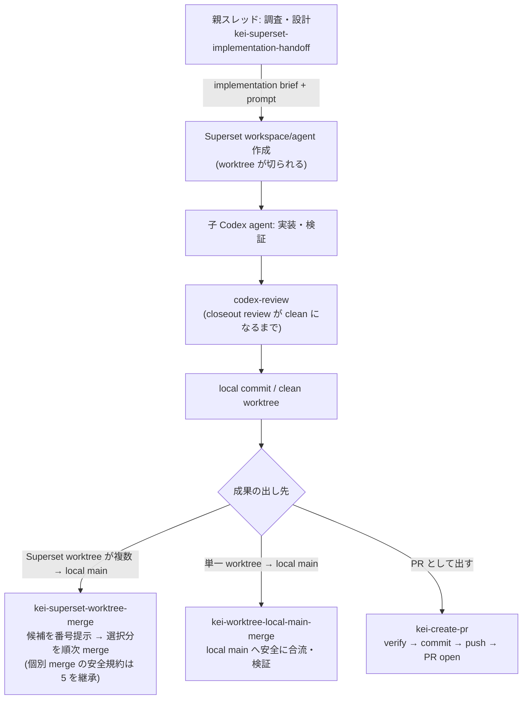

# Superset Handoff Flow

Codex の親スレッドが調査・作業設計を行い、[Superset](https://superset.sh) 経由で子の Codex agent に repo-scoped な実装を委譲し、レビュー・merge まで安全に回すための skill セットです。

品質を上げる主因は Superset を使うことではなく、親が先に「正 (source of truth)・所有範囲・検証・停止条件」を固定し、子 agent が迷わず実装できる handoff を作ることです。

## Flow



## Skills

| # | skill | 役割 |
|---:|---|---|
| 1 | `kei-superset-implementation-handoff` | 親スレッドの調査 → implementation brief 作成 → Superset launch まで |
| 2 | `kei-handoff` | 自己完結した repo-scoped handoff prompt を書くための規律（1 の下敷き） |
| 3 | `codex-review` | 子 agent の closeout review。accepted finding がゼロになるまで回す（helper script 同梱） |
| 4 | `kei-superset-worktree-merge` | Superset が作った worktree 群を番号付きで提示し、選択分を順番に merge（安全確認は 5 の規約を継承） |
| 5 | `kei-worktree-local-main-merge` | 単一 worktree の完了 commit を親 repo の local `main` に安全に合流する本体手順 |
| 6 | `kei-create-pr` | PR として出す場合の workflow。verify → commit → push → PR open まで |

## Setup

前提: [Codex CLI](https://github.com/openai/codex) と [Superset CLI](https://superset.sh) 。未導入の場合は各公式手順でインストール・認証してください（[SETUP.md](SETUP.md) 参照）。

```bash
git clone https://github.com/kei-prog/superset-handoff-flow.git
cd superset-handoff-flow
./install.sh
```

`install.sh` は冪等で、前提 command の確認 → `~/.codex/skills/` への個別 symlink → 導入検証まで行います。既存 skill は上書きしません。

導入確認は Codex セッションで `$kei-superset-implementation-handoff` を呼び出せることです。

### Codex にセットアップさせる

Codex セッションに次をそのまま貼れば、Superset の導入から skill の global 配置・検証まで自動で完了します。

```text
https://github.com/kei-prog/superset-handoff-flow をセットアップしてください。

1. この repo を local に clone する（既に clone 済みならそれを使い、git pull で最新化する）。
2. repo 内の SETUP.md を読み、その手順に従う。要点:
   - ./install.sh を実行し、skills/* を ~/.codex/skills/ に symlink として global 配置する。
   - install.sh が superset を MISSING と報告したら、公式 https://superset.sh の手順でインストール・認証し、superset status が通ることを確認してから install.sh を再実行する。
   - 既存の同名 skill（実体ディレクトリ）があった場合は上書きせず、SKIPPED として報告する。
3. 検証: install.sh が exit 0、全 skill が ok、codex-review helper が動くこと。
4. 報告: install.sh の結果、MISSING/SKIPPED/FAILED の有無、superset status の結果を表で報告する。

インストールが必要なのは superset のみ。それ以外のツールの新規インストールや、~/.codex 配下の他ファイルの変更はしないでください。
```

## Placeholders

skill 内の以下の placeholder は環境に合わせて読み替え（または書き換え）てください。

| placeholder | 意味 |
|---|---|
| `<org>/<repo>` | 対象 GitHub repository |
| `<your-clones-root>` | local clone のルート（例: `~/ghq/github.com`） |
| `pnpm ci:check` | あなたの repo の CI gate command の例 |

## License

MIT
