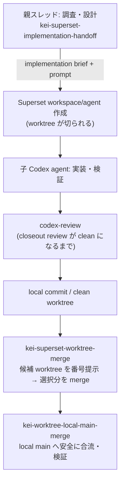

# Superset Handoff Flow

Codex の親スレッドが調査・作業設計を行い、[Superset](https://superset.sh) 経由で子の Codex agent に repo-scoped な実装を委譲し、レビュー・merge まで安全に回すための skill セットです。

品質を上げる主因は Superset を使うことではなく、親が先に「正 (source of truth)・所有範囲・検証・停止条件」を固定し、子 agent が迷わず実装できる handoff を作ることです。

## Flow



## Skills

| # | skill | 役割 |
|---:|---|---|
| 1 | `kei-superset-implementation-handoff` | 親スレッドの調査 → implementation brief 作成 → Superset launch まで |
| 2 | `kei-handoff` | 自己完結した repo-scoped handoff prompt を書くための規律（1 の下敷き） |
| 3 | `codex-review` | 子 agent の closeout review。accepted finding がゼロになるまで回す（helper script 同梱） |
| 4 | `kei-superset-worktree-merge` | Superset が作った worktree 群を番号付きで提示し、選択分を順番に merge |
| 5 | `kei-worktree-local-main-merge` | worktree の完了 commit を親 repo の local `main` に安全に合流 |

## Setup

前提: [Codex CLI](https://github.com/openai/codex) と Superset CLI がセットアップ済みであること。

```bash
git clone https://github.com/kei-prog/superset-handoff-flow.git
cd superset-handoff-flow
for s in skills/*/; do
  ln -s "$(pwd)/$s" ~/.codex/skills/"$(basename "$s")"
done
```

導入確認: Codex セッションで `$kei-superset-implementation-handoff` を呼び出し、skill が読み込まれることを確認してください。

## Placeholders

skill 内の以下の placeholder は環境に合わせて読み替え（または書き換え）てください。

| placeholder | 意味 |
|---|---|
| `<org>/<repo>` | 対象 GitHub repository |
| `<your-clones-root>` | local clone のルート（例: `~/ghq/github.com`） |
| `pnpm ci:check` | あなたの repo の CI gate command の例 |

## License

MIT
