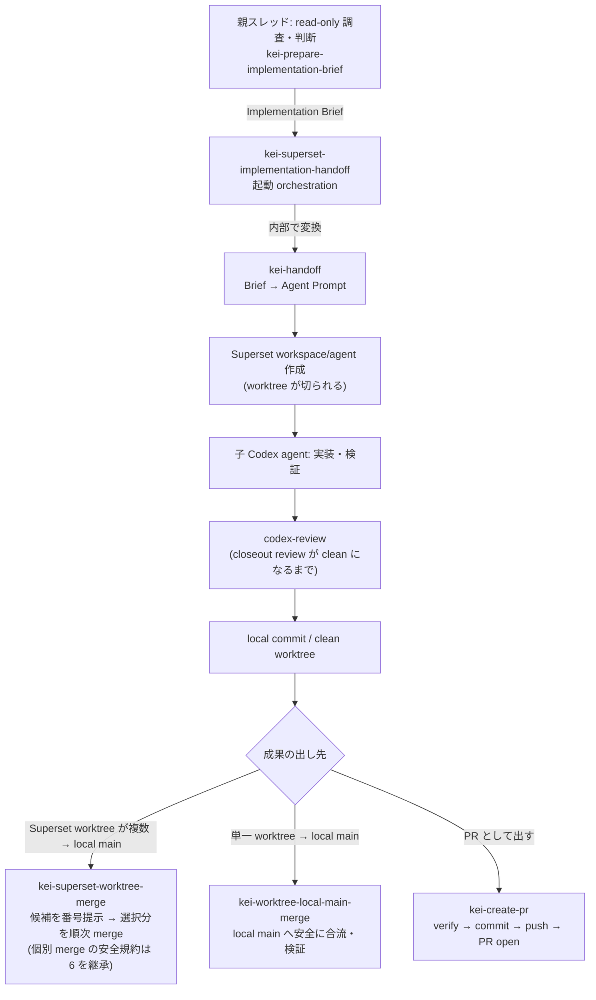

# Superset Handoff Flow

Codex の親スレッドが read-only 調査から Implementation Brief を作り、自己完結した Agent Prompt へ変換し、[Superset](https://superset.sh) 経由で子の Codex agent に repo-scoped な実装を委譲して、レビュー・merge まで安全に回すための skill セットです。

品質を上げる主因は Superset を使うことではなく、親が先に「正 (source of truth)・所有範囲・検証・停止条件」を固定し、子 agent が迷わず実装できる handoff を作ることです。

## Flow



通常ユーザーが呼ぶのは `$kei-prepare-implementation-brief` と `$kei-superset-implementation-handoff` の 2 つです。後者が内部で `$kei-handoff` を使います。

## Skills

| # | skill | 役割 |
|---:|---|---|
| 1 | `kei-prepare-implementation-brief` | repo を read-only で調査し、実装判断の正本となる Implementation Brief を作る |
| 2 | `kei-handoff` | 完成済み Brief を判断内容を変えず、自己完結した Agent Prompt へ変換する |
| 3 | `kei-superset-implementation-handoff` | 2 を内部利用して Superset を起動し、Codex の実行開始を証拠で確認する |
| 4 | `codex-review` | 子 agent の closeout review。accepted finding がゼロになるまで回す（helper script 同梱） |
| 5 | `kei-superset-worktree-merge` | Superset が作った worktree 群を番号付きで提示し、選択分を順番に merge（安全確認は 6 の規約を継承） |
| 6 | `kei-worktree-local-main-merge` | 単一 worktree の完了 commit を親 repo の local `main` に安全に合流する本体手順 |
| 7 | `kei-create-pr` | PR として出す場合の workflow。verify → commit → push → PR open まで |

## Setup

前提: [Codex CLI](https://github.com/openai/codex) と [Superset CLI](https://superset.sh) 。未導入の場合は各公式手順でインストール・認証してください（[SETUP.md](SETUP.md) 参照）。

```bash
git clone https://github.com/kei-prog/superset-handoff-flow.git
cd superset-handoff-flow
./install.sh
```

`install.sh` は冪等で、前提 command の確認 → `~/.codex/skills/` への個別 symlink → 導入検証まで行います。既存 skill は上書きしません。

導入確認は Codex セッションで `$kei-prepare-implementation-brief` と `$kei-superset-implementation-handoff` を呼び出せることです。Codex では skill が `$skill名` の形で候補表示・発動されることがあります。

### Codex にセットアップさせる

Codex セッションに次をそのまま貼れば、Superset の導入から skill の global 配置・検証まで自動で完了します。

```text
https://github.com/kei-prog/superset-handoff-flow をセットアップしてください。

1. この repo を local に clone する（既に clone 済みならそれを使い、git pull で最新化する）。
2. repo 内の SETUP.md を読み、その手順に従う。要点:
   - ./install.sh を実行し、skills/* を ~/.codex/skills/ に symlink として global 配置する。
   - ./install.sh は superset CLI を自動インストールしない。MISSING の検出と skill 配置・検証だけを行う。
   - install.sh が superset を MISSING と報告したら、公式 https://superset.sh の手順でインストール・認証し、superset status が通ることを確認してから install.sh を再実行する。
   - Superset は Experience v2 mode を有効にしておく。この設定が確認できない場合は、ユーザーに Superset app で Experience v2 mode を有効化してもらい、完了後に再確認する。
   - 既存の同名 skill（実体ディレクトリ）があった場合は上書きせず、SKIPPED として報告する。
3. ユーザー操作が必要な場合は、その場で止まり、ユーザーが実行すべき操作を具体的に指示する。例: OS 権限確認、ブラウザでのログイン、認証コード入力、手元でしか完了できないインストーラ操作。
4. 検証: install.sh が exit 0、全 skill が ok、codex-review helper が動くこと。
5. 報告: install.sh の結果、MISSING/SKIPPED/FAILED の有無、superset status、Experience v2 mode の確認結果を表で報告する。

インストールが必要なのは superset のみ。それ以外のツールの新規インストールや、~/.codex 配下の他ファイルの変更はしないでください。
```

### セットアップから試用まで体験する

新しい Codex セッションに次をそのまま貼ると、セットアップ確認から disposable repo での試用まで agent が案内します。

```text
https://github.com/kei-prog/superset-handoff-flow をセットアップし、試しに一度使えるところまで案内してください。

1. repo を local に clone する（既に clone 済みならそれを使い、git pull で最新化する）。
2. SETUP.md を読み、install.sh を実行して skill を ~/.codex/skills/ に symlink 配置する。
3. install.sh が MISSING を報告した場合:
   - superset が MISSING の場合は、公式手順を確認し、agent が実行できる install は agent が行う。
   - codex が MISSING の場合は、この体験に必要な実行環境が足りないため、ユーザーに Codex のセットアップを依頼して止まる。
   - ブラウザログイン、OS 権限、認証コード入力などユーザー操作が必要な場合は、そこで止まり、ユーザーが次に行う操作を 1 つずつ具体的に指示する。
   - 操作完了後に install.sh と superset status を再実行する。
4. セットアップ検証:
   - install.sh が exit 0
   - $kei-prepare-implementation-brief が読める
   - $kei-superset-implementation-handoff が読める
   - superset --version と superset status が通る
   - Superset の Experience v2 mode が有効
   - codex-review helper が動く
5. 試用:
   - push / PR / deploy はしない。
   - 原則として disposable な local git repo を作る。作れない場合だけ、ユーザーに試用対象 repo を 1 つ選ばせる。
   - $kei-prepare-implementation-brief で README に 1 行を追加する程度の小さい repo-scoped task を調査し、Implementation Brief を作る。
   - 続けて $kei-superset-implementation-handoff を使い、その Brief を Superset 経由で Codex agent に渡す。内部の Agent Prompt 変換には $kei-handoff が使われる。Codex 上では skill が $skill名 の形で候補表示・発動されることがある。
   - Superset project / workspace / agent 設定が足りない場合は、推測で進めず、ユーザーが行う必要のある操作を具体的に指示する。
6. 体験完了報告:
   - setup 結果
   - superset status
   - Superset の Experience v2 mode 確認結果
   - 作成または利用した workspace / worktree
   - 子 agent に渡した task
   - 実際に変更された file
   - push / PR / deploy をしていないこと
```

## Placeholders

skill 内の以下の placeholder は環境に合わせて読み替え（または書き換え）てください。

| placeholder | 意味 |
|---|---|
| `<org>/<repo>` | 対象 GitHub repository |
| `<your-clones-root>` | local clone のルート（例: `~/ghq/github.com`） |
| `pnpm ci:check` | あなたの repo の CI gate command の例 |

## License

MIT
